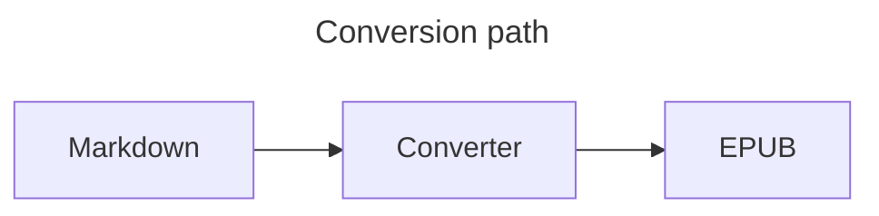
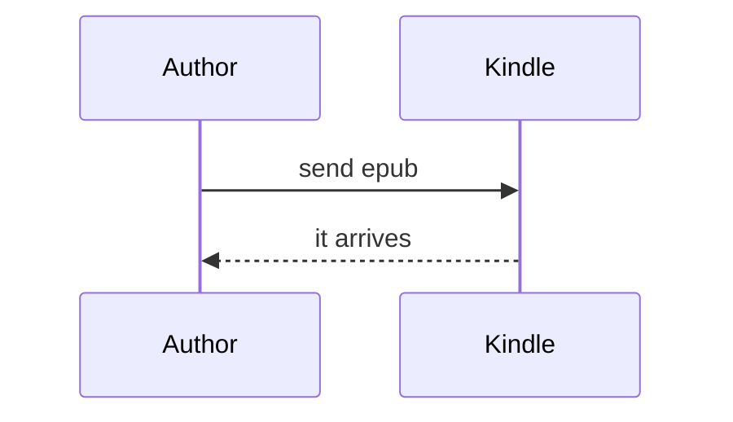

# Diagrams

A flowchart with a title:



A sequence diagram:



An ordinary fence, which must stay a code block:

```bash
md2epub notes.md --diagrams --kindle
```

A deliberately broken diagram, which must degrade rather than fail:

```mermaid
graph TD
    this is not ((valid mermaid {{{
```
